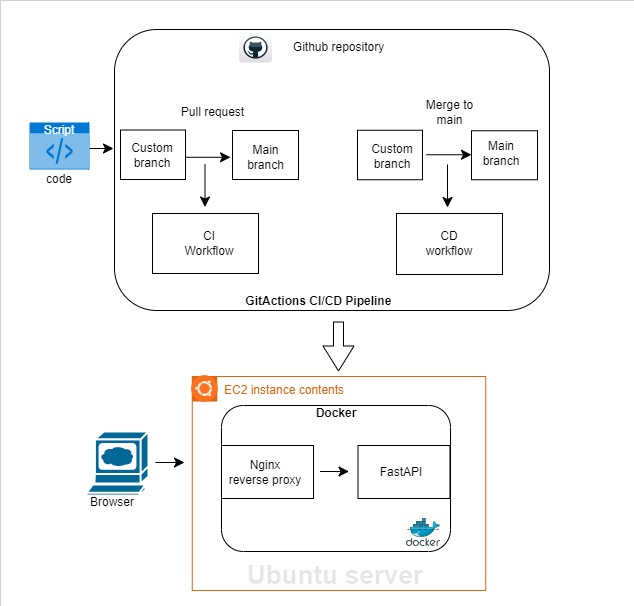
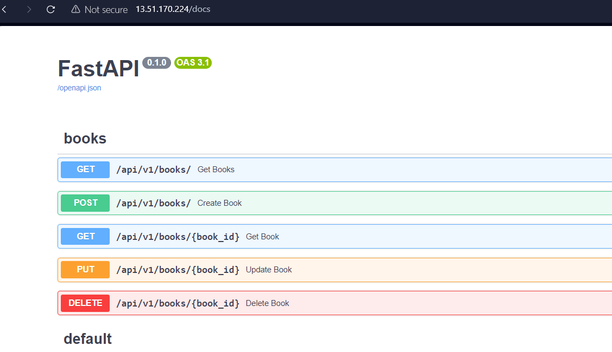
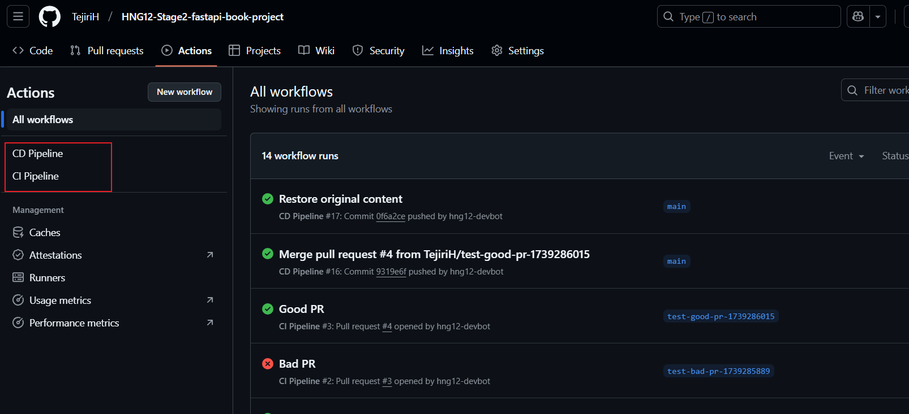

# FastAPI Book Management API

## Overview

This project is a RESTful API built with FastAPI for managing a book collection. It provides comprehensive CRUD (Create, Read, Update, Delete) operations for books with proper error handling, input validation, and documentation.

## Features

- 📚 Book management (CRUD operations)
- ✅ Input validation using Pydantic models
- 🔍 Enum-based genre classification
- 🧪 Complete test coverage
- 📝 API documentation (auto-generated by FastAPI)
- 🔒 CORS middleware enabled

## Project Structure

```
fastapi-book-project/
├── api/
│   ├── db/
│   │   ├── __init__.py
│   │   └── schemas.py      # Data models and in-memory database
│   ├── routes/
│   │   ├── __init__.py
│   │   └── books.py        # Book route handlers
│   └── router.py           # API router configuration
├── core/
│   ├── __init__.py
│   └── config.py           # Application settings
├── tests/
│   ├── __init__.py
│   └── test_books.py       # API endpoint tests
├── main.py                 # Application entry point
├── requirements.txt        # Project dependencies
└── README.md
```

## Technologies Used

- Python 3.12
- FastAPI
- Pydantic
- pytest
- uvicorn

## Installation

1. Clone the repository:

```bash
git clone https://github.com/hng12-devbotops/fastapi-book-project.git
cd fastapi-book-project
```

2. Create a virtual environment:

```bash
python -m venv venv
source venv/bin/activate  # On Windows: venv\Scripts\activate
```

3. Install dependencies:

```bash
pip install -r requirements.txt
```

## Running the Application

1. Start the server:

```bash
uvicorn main:app
```

2. Access the API documentation:

- Swagger UI: http://localhost:8000/docs
- ReDoc: http://localhost:8000/redoc

## API Endpoints

### Books

- `GET /api/v1/books/` - Get all books
- `GET /api/v1/books/{book_id}` - Get a specific book
- `POST /api/v1/books/` - Create a new book
- `PUT /api/v1/books/{book_id}` - Update a book
- `DELETE /api/v1/books/{book_id}` - Delete a book

### Health Check

- `GET /healthcheck` - Check API status

## Book Schema

```json
{
  "id": 1,
  "title": "Book Title",
  "author": "Author Name",
  "publication_year": 2024,
  "genre": "Fantasy"
}
```

Available genres:

- Science Fiction
- Fantasy
- Horror
- Mystery
- Romance
- Thriller

## Running Tests

```bash
pytest
```

## Error Handling

The API includes proper error handling for:

- Non-existent books
- Invalid book IDs
- Invalid genre types
- Malformed requests

## Contributing

1. Fork the repository
2. Create a feature branch (`git checkout -b feature/AmazingFeature`)
3. Commit changes (`git commit -m 'Add AmazingFeature'`)
4. Push to branch (`git push origin feature/AmazingFeature`)
5. Open a Pull Request

## License

This project is licensed under the MIT License - see the [LICENSE](LICENSE) file for details.

## Support

For support, please open an issue in the GitHub repository.

## CI/CD Pipeline



## Overview

The CI/CD pipeline automates testing, building, and deploying the FastAPI application using **GitHub Actions** and **DockerHub**.

## Clone the Repository
 
>git clone https://github.com/your-username/FastAPI-Book-project.git
>cd FastAPI-Book-project

## Write our Dockerfile & nginx.conf

Dockerfile is written to Use the official lightweight Python image and also to run nginx-reverse-proxy, nginx.conf file was also created with configurations accordingly to redirect the request.

## AWS EC2 
Ensure Docker is installed on your EC2 instance(Ubuntu):

```
sudo apt update
sudo apt install -y docker.io
sudo systemctl start docker
sudo systemctl enable docker
```
## Workflow Steps

1. Code Push to GitHub → Triggers GitHub Actions.

2. GitHub Actions

- Runs tests using pytest.
- Builds the Docker image.
- Pushes the image to DockerHub.
- Connects to AWS EC2 via SSH.
- Pulls the latest image and runs it inside a Docker container.

3. AWS EC2 Instance:

- Runs Nginx as a reverse proxy.
- Runs the FastAPI application inside a Docker container.

## GitHub Actions Workflow

```
name: CD Pipeline

on:
  push:
    branches:
      - main  # Run this workflow when code is merged into main

jobs:
  deploy:  # Job name must be exactly "deploy"
    runs-on: ubuntu-latest

    steps:
      - name: Checkout Repository
        uses: actions/checkout@v4

      - name: Set up AWS CLI
        run: |
          curl "https://awscli.amazonaws.com/awscli-exe-linux-x86_64.zip" -o "awscliv2.zip"
          unzip awscliv2.zip
          sudo ./aws/install --update  # <-- Add --update flag
          aws --version

      - name: Set up SSH Key
        run: |
          echo "${{ secrets.PRIVATE_KEY_PEM }}" > private_key.pem
          chmod 600 private_key.pem

      - name: Configure AWS Credentials
        run: |
          aws configure set aws_access_key_id ${{ secrets.AWS_ACCESS_KEY_ID }}
          aws configure set aws_secret_access_key ${{ secrets.AWS_SECRET_ACCESS_KEY }}
          aws configure set default.region ${{ secrets.AWS_REGION }}


      - name: Authenticate with DockerHub
        run: |
          echo "${{ secrets.DOCKERHUB_PASSWORD }}" | docker login -u "${{ secrets.DOCKERHUB_USERNAME }}" --password-stdin

      - name: Build and Push Docker Image
        run: |
          docker build -t ${{ secrets.DOCKERHUB_USERNAME }}/fastapi-app:latest .
          docker push ${{ secrets.DOCKERHUB_USERNAME }}/fastapi-app:latest

      - name: Deploy to EC2
        run: |
          ssh -i private_key.pem -o StrictHostKeyChecking=no ubuntu@${{ secrets.EC2_PUBLIC_IP }} << 'EOF'
          sudo docker stop fastapi-container || true
          sudo docker rm fastapi-container || true
          sudo docker rmi ${{ secrets.DOCKERHUB_USERNAME }}/fastapi-app:latest || true  # Remove old image
          sudo docker pull ${{ secrets.DOCKERHUB_USERNAME }}/fastapi-app:latest  # Pull new image
          sudo docker run -d --name fastapi-container -p 80:80 -p 127.0.0.1:8000:8000 ${{ secrets.DOCKERHUB_USERNAME }}/fastapi-app:latest
          EOF
```

## Configuration

## Secrets in GitHub

Add the following secrets to your GitHub repository:

- DOCKERHUB_USERNAME - Your DockerHub username
- DOCKERHUB_PASSWORD - Your DockerHub password
- EC2_PUBLIC_IP - Public IP of your AWS EC2 instance
- PRIVATE_KEY_PEM - Private SSH key for EC2 connection
- AWS-ACCESS-KEY - AWS Access key
- AWS-SECRET-KEY - AWS Secret access key


## Access the application

We then accessed the application on 
>http://instance-public-ip/docs which confirms nginx redirecting the traffic to the api.



## Troubleshooting

## Common Issues and Fixes

- Port 80 not accessible? Make sure your EC2 security group allows HTTP traffic.

- Permission denied for Docker? Use sudo docker ps.

- GitHub Actions failing to SSH? Check if the PRIVATE_KEY_PEM is correct.

## Contribution
Invited hng12-devbotops as a collaborator to test the pipeline and ensure it works correctly.



## Conclusion
This project implements a FastAPI application with a Dockerized environment and automated deployment using GitHub Actions and DockerHub. 🚀